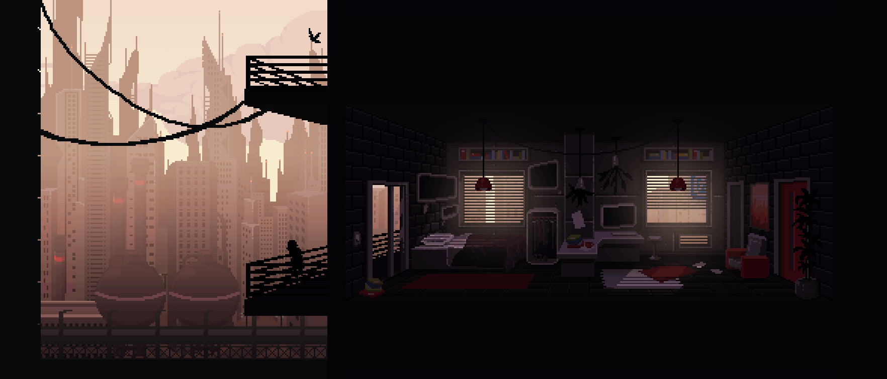

<div align="center">



<br/>

<!-- Typing animation -->
[](https://git.io/typing-svg)

<br/>

<!-- Badges -->
<a href="https://harshsec.xyz">
  
</a>
&nbsp;

<a href="https://instagram.com/root_harsh">
  
</a>

<br/><br/>

<!-- Profile views counter -->


</div>

---


##  About Me

```yaml
name        : Harsh Ravaliya
age         : 17
location    : India 🇮🇳
role        : Student & Cybersecurity Enthusiast
interests   : [Ethical Hacking, Web Dev, CTF Challenges]
learning    : [Python, Linux, Network Security, Bash]
hobbies     : [Guitar 🎸, Gaming 🎮, Music 🎧]
website     : harshsec.xyz
status      : "Always learning, always breaking things legally"
```


##  Tech Stack

<div align="center">

### Languages & Core


### Tools & Platforms


### Security Arsenal
`Nmap` &nbsp;•&nbsp; `Wireshark` &nbsp;•&nbsp; `Metasploit` &nbsp;•&nbsp; `Burp Suite` &nbsp;•&nbsp; `Aircrack-ng` &nbsp;•&nbsp; `Kali Linux`

</div>


##  GitHub Stats

<div align="center">


<br/>


</div>


##  Contribution Snake

<div align="center">

<picture>
  <source media="(prefers-color-scheme: dark)" srcset="https://raw.githubusercontent.com/harshravaliya/harshravaliya/output/github-contribution-grid-snake-dark.svg" />
  <source media="(prefers-color-scheme: light)" srcset="https://raw.githubusercontent.com/harshravaliya/harshravaliya/output/github-contribution-grid-snake.svg" />
  
</picture>

</div>


##  Currently

<div align="center">

| Area | Focus |
|:-----|:------|
| 🔐 **Security** | Learning penetration testing & CTF challenges |
| 🐍 **Python** | Building automation tools & security scripts |
| 🌐 **Web Dev** | Crafting personal projects & portfolio |
| 📡 **Networking** | Understanding protocols & packet analysis |
| 🎸 **Off-screen** | Shredding guitar riffs |

</div>


<div align="center">

###  Let's Connect

*"The quieter you become, the more you are able to hear."* — Kali Linux motto

<br/>

<a href="https://harshsec.xyz">
  
</a>

<br/><br/>


</div>
